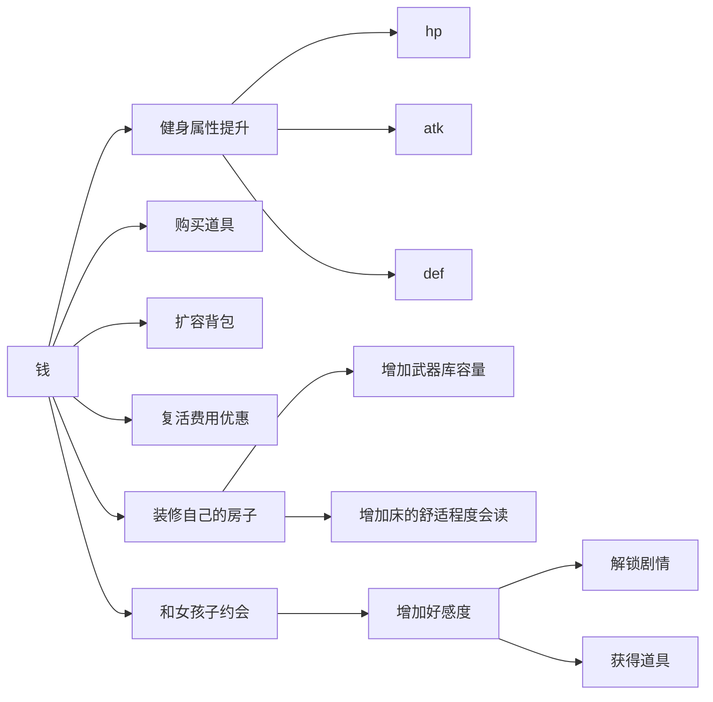
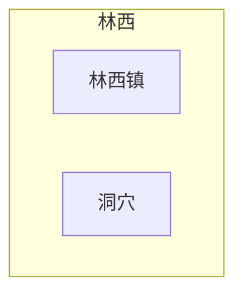
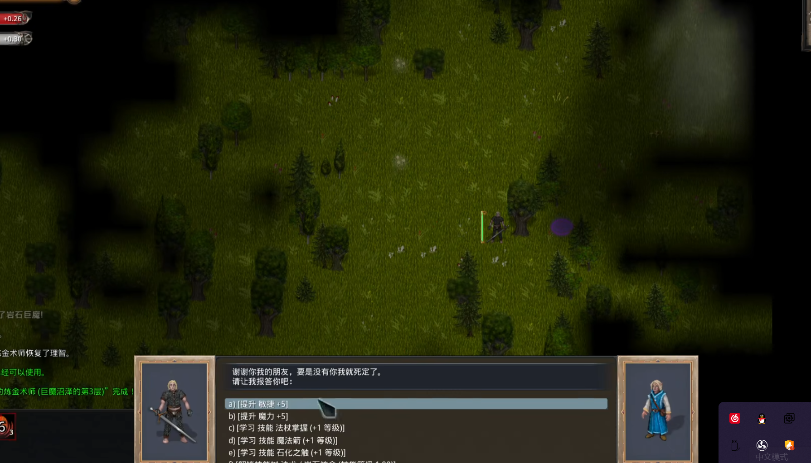
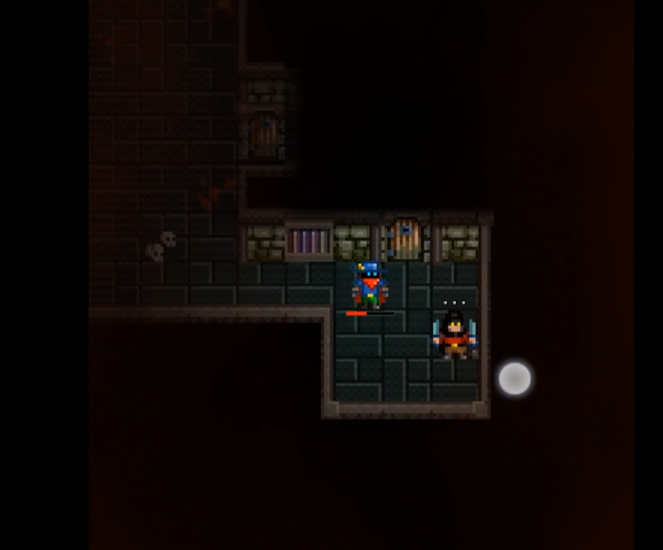

# 游戏整体设计

## 游戏概述

《林西物语》是一个rouguelite游戏，但是对传统的回合制进行了修改。所有人的移动不再按照四方向或者八方向而是自由移动。而且重点引入了队友系统，让游戏中可以像RTS那样操作队友。整体来说这个游戏就是一个回合制的RTS。

游戏借鉴了JRPG剧情先行的设计。因此存在线性关卡。因此在局外做了养成系统。玩家每局无论胜负都会得到永久的资源，用于局外的成长。

在局外的大地图设计上，采用了类似塞尔达的箱庭解密设计。会根据剧情推进解锁新的能力，从而扩大地图探索范围。

游戏核心想要表达和伙伴们相识再分离的感受。非常强调角色之间的连结。

## 游戏体验

- 和伙伴们一起热闹的冒险

- 简洁顺滑的操作方式

- 可以随时停下来思考策略

  - 技能选择
  - 技能树和技能点选择
  - 队友操作

  

## 游戏参考

| 参考内容 | 参考                                                         |
| -------- | ------------------------------------------------------------ |
| 剧情设计 | 《遠天、とある忘れ物》的评论区 https://music.163.com/song?id=721243&userid=326269003 |
| 玩法设计 | 《主教之旅2》                                                |
|          | 《马基埃亚尔的传说》                                         |

# 系统和数值设计

## 战斗系统

1. 追求策略深度
   1. 采用我动敌动的设计
   2. 

2. 肉鸽的核心

   1. 多角色选择
   2. 游戏过程中多武器/道具
   3. 游戏中多技能
   4. 离开地牢之后所有迷宫内的道具武器都会保留（玩家可以有一个魔法包裹，装在里面的东西不会消失）
   5. 获得的道具和武器可以卖钱
   6. 卖出来的钱可以换永久升级

每打完一关，都可以获得一个角色的辅助

### 队友系统

每一个角色的本质就是一个棋子，每一个棋子都带有1个技能（可以手动控制）：

| 队友 | 效果        |
| ---- | ----------- |
|      | 开枪        |
|      | 恢复并+速度 |
|      |             |

### build

1. 技能
2. 用怪物掉落的道具合成物品
3. 

## 经济系统

   

## 随机地牢系统 

| 随机                                             | 说明                                        |      |
| ------------------------------------------------ | ------------------------------------------- | ---- |
| 地下城/地图                                      | 每3关一个补给点。每一关内会有随机的商人出没 |      |
| 武器存在耐久                                     | 一把武器攻击一定次数会坏掉                  |      |
| 所有的道具都可以放到背包里面带走                 |                                             |      |
| 关卡中死亡，会消耗金钱，但是不会损失道具和武器   |                                             |      |
| 关卡结束后游戏内获得的等级和buff会消失，别的保留 |                                             |      |
|                                                  |                                             |      |
|                                                  |                                             |      |

## 地图系统

本游戏的地图采用了传统JRPG的大+随机地图

- 拥有大地图，但是大地图到达另一个地点需要打随机地牢
- 不同区域的随机地牢里面会有不同的NPC和特殊地点

- - 

| 地图名称 | 区域名称 | 特殊地点                             |
| -------- | -------- | ------------------------------------ |
| 林西     | 林西镇   | （城镇）详细见[城镇系统](##城镇系统) |
|          | 洞穴     |                                      |
| 迷踪林   | 林子浅处 | 猎人营地                             |
|          |          |                                      |
|          | 林子深处 | 叶千秋的家                           |
|          |          |                                      |
|          |          |                                      |
| 古之国   | 访古道   |                                      |
|          | 鸟鸣林   |                                      |

### 地形系统

| 地形 | 效果 | 交互效果               |
| ---- | ---- | ---------------------- |
| 树木 |      | 可以被攻击，让地形消失 |
|      |      |                        |
|      |      |                        |

地图中的环境交互？

- 树木可以砍伐
- 树木和草地可以被火烧，而且会燃烧周围
- 墙壁会遮挡子弹
- 岩浆会造成伤害
- 

## 城镇系统

| 设施     | 功能                                                         |      |
| -------- | ------------------------------------------------------------ | ---- |
| 酒馆     | 进行伙伴的招募 玩家住宿和个人房间、 学习、升级烹饪能力 |      |
| 铁匠铺   | 进行武器的升级  装备的购买和升级                        |      |
| 侠客协会 |                                                              |      |
|          |                                                              |      |
|          |                                                              |      |

- 典当铺
  - 可以贩卖物品
  - 购买价值高的特殊物品
- 寺院
  - 锻炼，增加各个属性值
  - 学习素食菜谱
  - 迷宫内增加体术类技能
- 道观
  - 升级道法
  - 购买符咒
  - 查阅书籍
  - 迷宫内增加法术类技能

## 支线系统

|          |                                                     |      |
| -------- | --------------------------------------------------- | ---- |
| 寻找老婆 | 第一次来到林西，NPC会纠结自己找什么样的老婆比较好   |      |
| 武器贩卖 | 村里的黑商要高价收购武器                            |      |
| 竞技场   | 村里举办了小组赛，获奖者可以得到神秘物品            |      |
| 叶千秋线 | 来到她的房子旁边送上一些蛋糕                        |      |
|          | 第二次来到她房子，送上一些过桥米线                  |      |
|          | 第三次，她会邀请你进来喝茶，之后会在每周5出现在酒馆 |      |
|          |                                                     |      |
|          |                                                     |      |
|          |                                                     |      |
|          |                                                     |      |

## 道具系统

| 物品名称 | 物品描述                                   |      |
| -------- | ------------------------------------------ | ---- |
| 血瓶     | 立刻恢复HP                                 |      |
| 信仰之书 | 立刻恢复信仰系技能的冷却                   |      |
| 回力药水 | 立刻恢复物理系技能的冷却                   |      |
| 十字架   | 复活一次                                   |      |
| 寻路地图 | 找到出口                                   |      |
| 宝藏地图 | 找到地图中所有的宝箱和武器                 |      |
| 望眼镜   | 可以看破敌人的弱点，在本局内敌人会有debuff |      |
|          |                                            |      |
|          |                                            |      |

## 敌人系统

| 敌人名称 | 敌人类型 | 敌人掉落物 | 敌人属性 |
| -------- | -------- | ---------- | -------- |
|          | 精英     |            |          |
|          |          |            |          |
|          |          |            |          |

## 武器系统

| 武器名称 |      |      |
| -------- | ---- | ---- |
|          |      |      |
|          |      |      |
|          |      |      |

## 技能系统

技能分为物理技能，信仰技能和魔法技能三部分。

在技能的专属程度上分别英雄专有的天赋技能和可以在地牢内随机掉落的普通技能

| 技能名称 | 技能描述             | 技能类型 |
| -------- | -------------------- | -------- |
| 治疗     | 治疗场上一个友方单位 | 物理技能 |
|          |                      |          |
|          |                      |          |
|          |                      |          |

## buff系统

buff是指可以持续生效的一种技能效果。往往是由技能系统或者道具系统调用的。

| buff名称 | 类型   | 效果                                       |
| -------- | ------ | ------------------------------------------ |
| 加速     | buff   | 让使用者暂时减少移动所需的时间             |
| 减速     | debuff | 让使用者暂时增加移动所需的时间             |
| 着火     |        | 让使用者按照HP的最大值比例进行掉血         |
| 时间停止 |        | 让使用者暂停时间                           |
| 隐蔽     |        | 减少被敌人发现的概率                       |
| 狂暴     |        | 增加攻击的命中率                           |
| 反射     |        | 将远程攻击反弹回去                         |
| 倒刺     |        |                                            |
| 无敌     |        | 免疫一切伤害                               |
| 恐惧     |        | 接下来若干回合内被攻击者将会随即移动或攻击 |

## 合成系统

合成系统是类似于做饭和合成道具的系统

# 文案设计

## 剧情概述

| 关键点 | 描述                                                         |
| ------ | ------------------------------------------------------------ |
| 表背景 | 一位强大的魔法师的女朋友因病死亡，他为了让她复活发明了可以减缓时间流逝的魔珠。如果把多个魔珠放到一起。就可以倒流时间。但是，这个魔珠会让自己的记忆也重置，而且会消耗大量生命力。最终他在无限的循环中和女朋友一起死去。而这些魔珠则被他的朋友封印在各地。只留下了可以倒流时间的传说。 |
| 里背景 | 游戏的                                                       |
| 主线   | 主角是武侠专业毕业的，但是毕业之后找不到工作。后来找到一个工资低还辛苦的保镖工作。主要是护送商队四处流浪。有一次商队来到了林西这个村庄旁边。突然出现了一场大地震，，主角进入林西之后，发现村子里面丢了一个孩子，主角表示愿意去找。主角在村庄外边的一个来到了一个洞穴，进入洞穴之后发现孩子已经死了，当主角把孩子尸体背出来的时候，发现村民都在找他，因为主角已经失踪2天了。而村民发现这个孩子居然是饿死的，但是只失踪了2天是不会饿死人的。大家都不知道为什么。很快这个消息传播开了，国王也得到了消息。 |
|        |                                                              |
|        |                                                              |

| 章节   | 小节   | 内容                                                         |
| ------ | ------ | ------------------------------------------------------------ |
| 第一章 | 第一节 | 主角来到了林西旁边的小丛林（新手战斗教学）                   |
|        |        | 主角来到了林西，发现村子里面丢了一个孩子，主角表示愿意去找   |
|        |        | 主角来到了一个洞穴，进入洞穴之后发现孩子已经死了，当主角把孩子尸体背出来的时候 |
|        |        |                                                              |
|        |        |                                                              |
|        |        |                                                              |
|        |        |                                                              |

概述：

这个故事主要讲解了一个有关时间倒流的故事。主角在冒险的途中遇到了许多美少女，和她们成为了伙伴。但是后来她们都因为意外死掉了。主角获得了禁忌的能力——时间倒流。最终倒转了时间，而自己也回到了过去。最终导致这个故事永远轮回下去。

剧情：

## 角色设计

| 角色   | 剧情设定                                                     | 年龄     | 职业 | 外貌 | 服装 | 性格 | 个性 |
| ------ | ------------------------------------------------------------ | -------- | ---- | ---- | ---- | ---- | ---- |
| 李二狗 | 古之国中央武侠学院毕业，擅长使用剑和一些简单的道术           | 25       |      |      |      |      |      |
| 林千叶 | 小之国的公主，小之国被古之国灭国。她正在搜集人手复兴祖国。   | 24现在19 |      |      |      |      |      |
| 小狐狸 | 狐妖，被人类杀害了父母，渴望复仇。3. 小镇单纯贤惠的采药娘，性格温柔善良 | 5        |      |      |      |      |      |
| 月千秋 | 小之国的公主，生性温柔善良。曾多次，最终离家出走             | 23       |      |      |      |      |      |
| 小药娘 | 身份未知                                                     |          |      |      |      |      |      |

## 角色定位

# 程序设计

## 类继承结构

 

## NPC的AI设计

1. NPC会跟随在玩家附近
2. NPC会攻击身边的敌人，并追击一小段距离
3. 当玩家靠的太近时，NPC会远离
4. 当玩家离得太远时，NPC会放弃一切行为，来追逐玩家

## 敌人的ai设计

# 美术设计

## 整体美术风格

| 风格                 | 参考                                                         |
| -------------------- | ------------------------------------------------------------ |
| 人物立绘风格         | gal的略微厚涂感觉  |
| 地图风格             | 像素  |
| 地图上怪物和人物风格 | 像素  |

## 美术需求

| 需求             | 说明 | 状态 |
| ---------------- | ---- | ---- |
| 主角的全身立绘*4 | 生气 |      |
|                  | 高兴 |      |
|                  | 严肃 |      |
|                  | 悲伤 |      |
|                  | 疑惑 |      |
|                  |      |      |
|                  |      |      |
|                  |      |      |

# 音乐音效设计

## 音乐需求

| 音乐功能 | 状态                                                         |
| -------- | ------------------------------------------------------------ |
| 主题曲   | 《冬之旅》https://music.163.com/song?id=1937405191&userid=326269003 |
|          |                                                              |
|          |                                                              |

## 音效需求

| 音效名称 | 状态 |
| -------- | ---- |
| 刀剑碰撞 |      |
|          |      |
|          |      |

