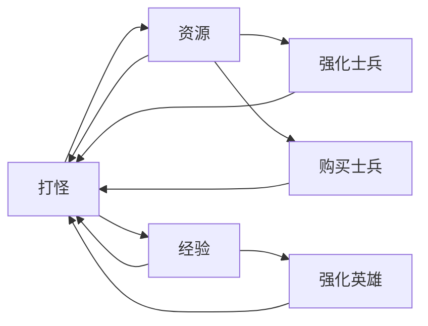
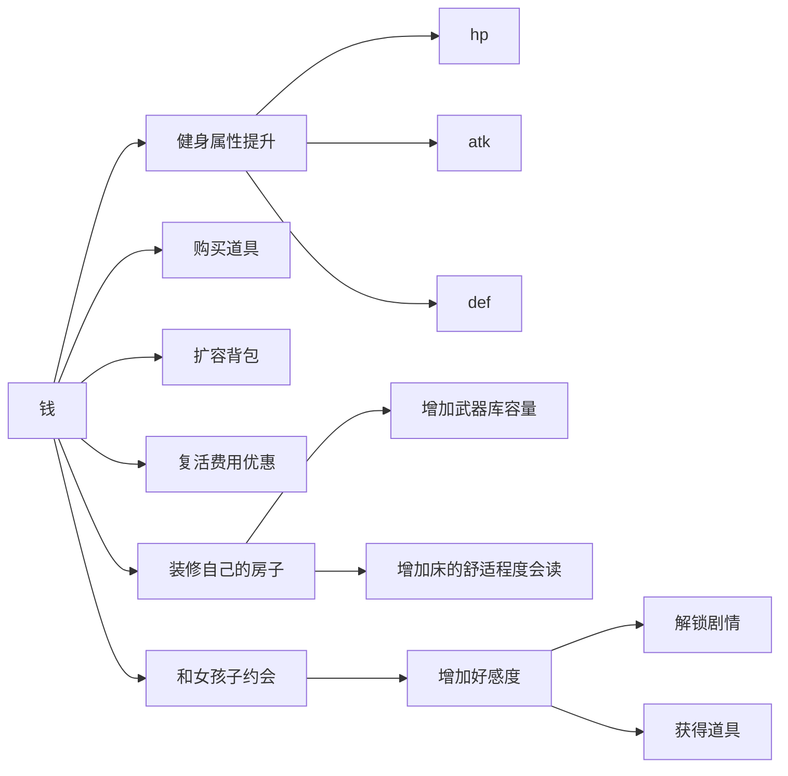
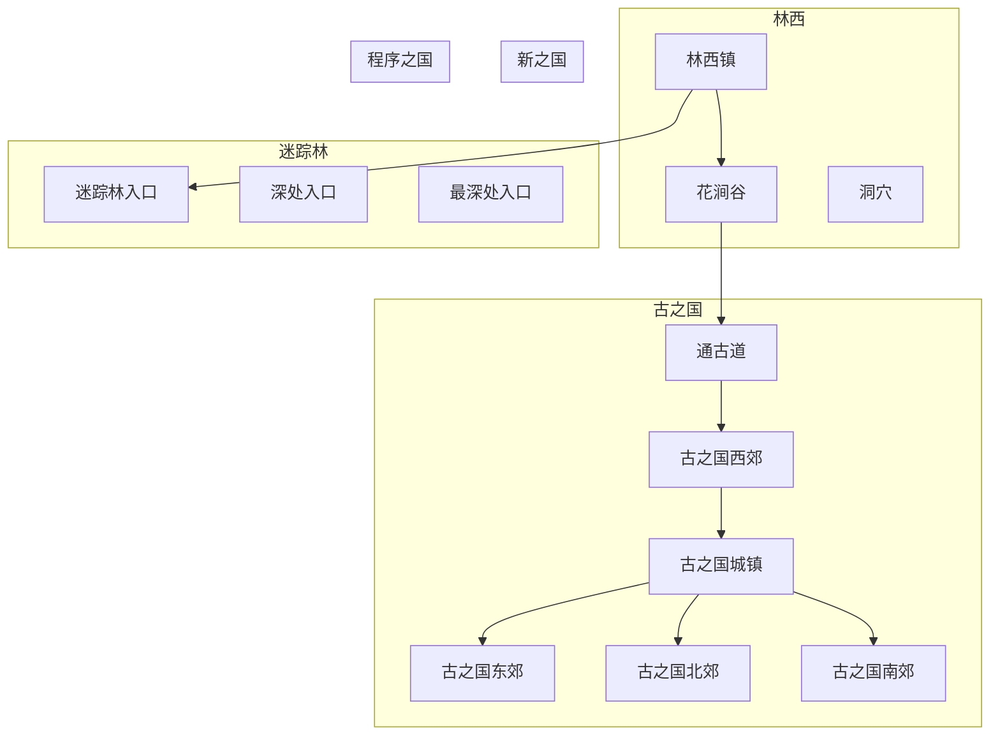

# 游戏整体设计

## 游戏概述

| 字段     | 子字段      | 描述                                                         |
| -------- | ----------- | ------------------------------------------------------------ |
| 游戏名称 |             | 《林西物语》                                                 |
| 核心表达 |             | 游戏核心想要表达和伙伴们相识再分离的感受。非常强调角色之间的连结。以及游戏内一期一会的感受。 |
| 局内机制 | 移动        | 《林西物语》是一个rouguelite游戏，但是对传统的回合制进行了修改。所有人的移动不再按照四方向或者八方向而是自由移动。 |
|          | RTS剧情模式 | 游戏内，玩家在随机地图中采集资源，用资源召集伙伴。也可以升级伙伴。伙伴可以进行一定的指令控制，但是不可以直接控制。 |
|          | 时间        | 游戏内随着时间的增长，                                       |
| 局外机制 |             | 游戏借鉴了JRPG剧情先行的设计。因此存在线性关卡。因此在局外做了养成系统。玩家每局无论胜负都会得到永久的资源，用于局外的成长。 |
| 剧情设计 | 叙事方式    | 采用了传统的JRPG的叙事方式，单主线+多结局+二周目的设定。     |
|          | 题材选择    | 《林西物语》采用了时间操控类的题材。主角需要不断回溯时间/加速时间来探索真相。 |
| 美术风格 |             | 人物采用平涂，地图素材采用像素。                             |

在局外的大地图设计上，采用了类似塞尔达的箱庭解密设计。会根据剧情推进解锁新的能力，从而扩大地图探索范围。

## 游戏核心体验

- 时间流逝，永不复返。唯有珍惜当下。必须让玩家意识到每一局都是独一无二的存在。
  - 游戏中和伙伴们一起热闹的冒险

- 简洁顺滑的操作方式

  - 可以随时停下来思考策略

  - 只操作一个角色，其他角色ai操作

- 有深度的策略
  
  
  
  
  

## 游戏参考

| 参考内容 |                          | 参考                                                         |
| -------- | ------------------------ | ------------------------------------------------------------ |
| 剧情设计 | 时间的无限循环           | 《遠天、とある忘れ物》的评论区 https://music.163.com/song?id=721243&userid=326269003 |
|          | 线性叙事方式             | 《神之天平》                                                 |
| 玩法设计 | 随机技能系统，技能树系统 | 《主教之旅2》                                                |
|          |                          | 《马基埃亚尔的传说》                                         |
|          | 兵种克制系统             | 《火焰纹章——风花雪月》                                       |
|          | 地图系统                 | 《废都物语》                                                 |
|          | 招募队友+探索            | 《帝国时代3》的剧情模式                                      |
|          | 时间系统                 | 《雨中冒险2》                                                |

# 系统和数值设计

## 战斗系统

| 机制 | 说明 |      |
| ---- | ---- | ---- |
|      |      |      |
|      |      |      |
|      |      |      |

1. 追求策略深度
   1. 采用我动敌动的设计
   2. 

2. 肉鸽的核心

   1. 多角色选择
   2. 游戏过程中多武器/道具
   3. 游戏中多技能
   4. 离开地牢之后所有迷宫内的道具武器都会保留（玩家可以有一个魔法包裹，装在里面的东西不会消失）
   5. 获得的道具和武器可以卖钱
   6. 卖出来的钱可以换永久升级

每打完一关，都可以获得一个角色的辅助

战斗循环

### 队友系统

每一个角色的本质就是一个棋子，每一个棋子都带有1个技能（可以手动控制）：

| 队友 | 效果        |
| ---- | ----------- |
|      | 开枪        |
|      | 恢复并+速度 |
|      |             |

### 合成系统

战斗中可以合成

### build

1. 技能
2. 用怪物掉落的道具合成物品
3. 

## 经济系统

   

## 随机地牢系统 

| 随机                                             | 说明                                        |      |
| ------------------------------------------------ | ------------------------------------------- | ---- |
| 地下城/地图                                      | 每3关一个补给点。每一关内会有随机的商人出没 |      |
| 武器存在耐久                                     | 一把武器攻击一定次数会坏掉                  |      |
| 所有的道具都可以放到背包里面带走                 |                                             |      |
| 关卡中死亡，会消耗金钱，但是不会损失道具和武器   |                                             |      |
| 关卡结束后游戏内获得的等级和buff会消失，别的保留 |                                             |      |
|                                                  |                                             |      |
|                                                  |                                             |      |

## 地图系统

| 地图设施 | 说明                                  | 升级之后     |
| -------- | ------------------------------------- | ------------ |
| 兵营     | 解锁之后，每隔60s生成一个单位         |              |
| 机枪塔   | 防御周围半径5单位，每隔2s可以攻击一次 |              |
| 拯救士兵 | 消灭周围的敌人之后可以让一些士兵加入  |              |
|          |                                       |              |
| 能源矿   | 可以不断产生资源                      | 产生更多zi'y |
|          |                                       |              |
|          |                                       |              |

本游戏的地图采用了传统JRPG的大+随机地图

- 拥有大地图，但是大地图到达另一个地点需要打随机地牢
- 不同区域的随机地牢里面会有不同的NPC和特殊地点

- - 

| 地图名称 | 区域名称 | 特殊地点                             |
| -------- | -------- | ------------------------------------ |
| 林西     | 林西镇   | （城镇）详细见[城镇系统](##城镇系统) |
|          | 洞穴     |                                      |
| 迷踪林   | 林子浅处 | 猎人营地                             |
|          |          |                                      |
|          | 林子深处 | 叶千秋的家                           |
|          |          |                                      |
|          |          |                                      |
| 古之国   | 访古道   |                                      |
|          | 鸟鸣林   |                                      |

### 大地图设计

### 地形系统

| 地形 | 效果      | 交互效果 |
| ---- | --------- | -------- |
| 树木 | 阻挡移动  |          |
| 草丛 | Buff.隐蔽 |          |
| 岩浆 | Buff.着火 |          |
| 冰   | Buff.加速 |          |
| 沼泽 | Buff.减速 |          |
|      |           |          |

地图中的环境交互？

- 树木可以砍伐
- 树木和草地可以被火烧，而且会燃烧周围
- 墙壁会遮挡子弹
- 岩浆会造成伤害
- 

## 城镇系统

| 设施     | 功能                                                         |      |
| -------- | ------------------------------------------------------------ | ---- |
| 酒馆     | 进行伙伴的招募 玩家住宿和个人房间、 学习、升级烹饪能力 |      |
| 铁匠铺   | 进行武器的升级  装备的购买和升级                        |      |
| 侠客协会 |                                                              |      |
| 典当铺   | 可以贩卖物品 购买价值高的特殊物品                            |      |
| 寺院     | 锻炼，增加各个属性值  学习素食菜谱  迷宫内增加体术类技能 |      |
| 道观     | 升级道法  购买符咒  查阅书籍  迷宫内增加法术类技能 |      |
|          |                                                              |      |
|          |                                                              |      |

## 支线系统

|          |                                                     |      |
| -------- | --------------------------------------------------- | ---- |
| 寻找老婆 | 第一次来到林西，NPC会纠结自己找什么样的老婆比较好   |      |
| 武器贩卖 | 村里的黑商要高价收购武器                            |      |
| 竞技场   | 村里举办了小组赛，获奖者可以得到神秘物品            |      |
| 叶千秋线 | 来到她的房子旁边送上一些蛋糕                        |      |
|          | 第二次来到她房子，送上一些过桥米线                  |      |
|          | 第三次，她会邀请你进来喝茶，之后会在每周5出现在酒馆 |      |
|          |                                                     |      |
|          |                                                     |      |
|          |                                                     |      |
|          |                                                     |      |

## 道具系统

| 物品名称 | 物品描述                                   |      |
| -------- | ------------------------------------------ | ---- |
| 血瓶     | 立刻恢复HP                                 |      |
| 信仰之书 | 立刻恢复信仰系技能的冷却                   |      |
| 回力药水 | 立刻恢复物理系技能的冷却                   |      |
| 十字架   | 复活一次                                   |      |
| 寻路地图 | 找到出口                                   |      |
| 宝藏地图 | 找到地图中所有的宝箱和武器                 |      |
| 望眼镜   | 可以看破敌人的弱点，在本局内敌人会有debuff |      |
|          |                                            |      |
|          |                                            |      |

## 敌人系统

| 敌人名称 | 敌人类型 | 敌人掉落物 | 敌人属性 |
| -------- | -------- | ---------- | -------- |
|          | 精英     |            |          |
|          |          |            |          |
|          |          |            |          |

## 武器系统

| 武器名称 |      |      |
| -------- | ---- | ---- |
|          |      |      |
|          |      |      |
|          |      |      |

## 技能系统

技能

技能分为物理技能，信仰技能和魔法技能三部分。

在技能的专属程度上分别英雄专有的天赋技能和可以在地牢内随机掉落的普通技能

| 技能名称 | 技能描述             | 技能类型 |
| -------- | -------------------- | -------- |
| 治疗     | 治疗场上一个友方单位 | 物理技能 |
| 闪现     | 立刻传送到一个地方   | 物理技能 |
|          |                      |          |
|          |                      |          |

## buff系统

buff是指可以持续生效的一种技能效果。往往是由技能系统或者道具系统调用的。.

| buff名称 | 类型   | 效果                                       |
| -------- | ------ | ------------------------------------------ |
| 加速     | buff   | 让使用者暂时减少移动所需的时间             |
| 减速     | debuff | 让使用者暂时增加移动所需的时间             |
| 着火     |        | 让使用者按照HP的最大值比例进行掉血         |
| 时间停止 |        | 让使用者暂停时间                           |
| 隐蔽     | buff   | 减少被敌人发现的概率                       |
| 狂暴     |        | 增加攻击的命中率                           |
| 反射     |        | 将远程攻击反弹回去                         |
| 倒刺     |        |                                            |
| 无敌     |        | 免疫一切伤害                               |
| 恐惧     |        | 接下来若干回合内被攻击者将会随即移动或攻击 |

## 合成系统

合成系统是类似于做饭和合成道具的系统

# 文案设计

## 剧情概述

| 关键点   | 描述                                                         |
| -------- | ------------------------------------------------------------ |
| 表背景   | 程序之国一直以来都崇拜一种叫做程序的神秘语言。但是一直没有人能成功。直到有一天，有一个天赋异禀的学者真的找出来了运行程序的方法。但是他也明白这种力量不是人类可以掌握的，于是他就一直没有说出去。后来他旅行途中，来到林西，爱上了这里的一个少女。结果没有多久，少女染上了重病，死去了。他非常伤心，最终决定使用程序回溯时间。而回溯时间的代价就是自己的记忆也会消失。就这样，他在自己都不知道的情况下不断回溯着时间。小镇无休止地重复着一天的生活。后来来往的商队发现了这个现象。消息瞬间传遍了世界，各个国家都开始追杀学者，以求掌握这种技术。他在逃亡中坚持抵抗，并开始大规模使用这些禁术。最终，他发现了一个事实，世界并不是只有一个，而是有无数的分支，他使用了一个禁咒，希望传送到别的世界。但是没想到世界因此全部合并了。他的存在，记忆和他所爱的少女全部都消失了。就连他所使用的禁术也被覆盖掉了。只剩下一个混乱的世界。 |
| 里背景   | 整个世界是一个实验游戏，一共有4个试验场，这里只是其中一个。游戏的实验目的是用ai来自动生成游戏。这个ai在开发的初期，存在非常多的废案和废弃的地图设计。最终管理世界的游戏ai选择了武侠的世界观。结果没想到有NPC找到了内部的调试代码，将开发版本进行了局部回退。但是她并没有阻止，ai认为这个设计很有意思，于是她打算观察。结果没想到NPC直接把分支merge了，她意识到情况不对。实验失败了。最后，她将错就错，将整个世界改造为混合世界。 |
| 主线背景 | 在这个世界除了一些主城之外，所有的区域都充满了怪物和随机地图。普通人想要到达别的城镇非常困难。因此报考武侠专业非常热门。主角也随大流包括了武侠专业，结果发现自己毕业的时候岗位早都饱和了，真的大佬早保送修真门派了，现在就连衙门的人都满了，一问全是各个门派的高材生。而且随着科技发展，普通人也可以靠科技打到怪物了。没办法，只能在家灵活就业，混了小半年之后，终于有一个镖局发了offer，让他当临时工护送商队去各个偏远村庄。虽然工资低还辛苦，但是好歹是有工作了。 |
| 第一章   | 有一次商队来到了林西这个村庄旁边。主角进入林西之后，发现村子里面丢了一个小女孩，果不其然，老板让临时工们去找一下。主角吃饭吃一半只得去找。找的时候，突然发现一个山洞，于是就进去了。一进去发现里面有很多脚印，于是继续前进。打败了山洞里的一些野兽之后，他突然发现前方有一个人躺在地上。一靠近。发现是一个全裸的美少女。在唤醒了之后，她介绍自己失忆了，自己也不知道为什么在这里。主角简单告诉了自己的目标之后，两人继续前进寻找丢失的小女孩。最后山洞深处发现了一个小女孩的尸体。但是奇怪的是，小女孩已经死了好几天了，而小女孩明明是下午才丢失的。然后两人把尸体搬出山洞的时候，奇怪的事情发生了。尸体居然重新长好了肌肤，小女孩复活了。两人忙问小女孩之前发生什么了。小女孩则说自己什么都不记得了。等3人回到了村庄，村里的人非常惊讶，因为主角也已经失踪了3天了。而主角自己实际上在山洞中待了不到半天。两人都意识到这个山洞的不寻常。村里人隆重地答谢了主角两人，村民告诉主角，老板看他也丢了，就跑路了。只留下了一些路费，让村民找到他之后，让他到古之国总部去。 |
| 第二章   | 美少女告诉主角自己叫做林千叶，是流浪的小药娘，来这里采药。然后表示自己打算去程序之国卖药。而主角告诉她程序之国已经灭亡了。但是她不相信。第二天主角发现她已经失踪了，于是自己前往了去古之国的路上。到了古之国， |
| 第三章   |                                                              |
|          |                                                              |

## 角色设计

| 角色   | 剧情设定                                                     | 年龄     | 职业                   | 外貌                                                         | 服装       | 性格                                                 | 个性 |
| ------ | ------------------------------------------------------------ | -------- | ---------------------- | ------------------------------------------------------------ | ---------- | ---------------------------------------------------- | ---- |
| 李二狗 | 古之国中央武侠学院毕业，擅长使用剑和一些简单的道术           | 25       | 侠客                   | 看打扮是标准的美少女，但是实际上是美少女。因为一直把头发扎起来的缘故，导致外观上会被认为的男生。声音也比较中性一点。 | 武侠的衣服 | 非常开摆，干事情没有动力，但是非常重视同伴。非常沙雕 |      |
| 林千叶 | 小之国的公主，小之国被古之国灭国。她正在搜集人手复兴祖国。   | 24现在19 | 原来是公主，现在是道术 | 娇小可爱，拥有及肩的长发                                     |            |                                                      |      |
| 小狐狸 | 狐妖，被人类杀害了父母，渴望复仇。3. 小镇单纯贤惠的采药娘，性格温柔善良 | 5        |                        |                                                              |            |                                                      |      |
| 月千秋 | 小之国的公主，生性温柔善良。曾多次，最终离家出走             | 23       |                        |                                                              |            |                                                      |      |
|        |                                                              |          |                        |                                                              |            |                                                      |      |

## 角色定位

## 国家设计

| 城镇名称 | 介绍                                                         | 主线任务 |
| -------- | ------------------------------------------------------------ | -------- |
| 古之国   | 历史悠久的国度，似乎在世界创世之初就有了。但是古之国的人却相当保守，一直不肯有创新。仍然遵循着非常老旧的规则和落后的生活。 |          |
| 新之国   | 从古之国中分裂出去的国度。受到周围国度的影响，古之国一部分人民也期望得到新科技。最终爆发了战争，古之国的一部分分裂出去，变成了新之国。为了和古之国彻底决裂，新之国采用了非常激进的国策，完全和古之国反着来，因此实际上国民的生活并不好 |          |
| 异之国   |                                                              |          |
| 蒸汽之国 | 和电气之国是死对头，始终认为蒸汽才是人类的未来，建造了许多巨型机器人。森林中无尽的木材为他们提供了能源。 |          |
|          |                                                              |          |
|          |                                                              |          |

# 程序设计

## 程序规范和约定

| 规则                                                   | 说明 |
| ------------------------------------------------------ | ---- |
| 所有的单例都叫Controller，只有GameManager可以叫Manager |      |
| 全局只有一个UIcanvas，用来放选项panel这些              |      |
|                                                        |      |

## 类继承结构

 

## NPC的AI设计

1. NPC会跟随在玩家附近
2. NPC会攻击身边的敌人，并追击一小段距离
3. 当玩家靠的太近时，NPC会远离
4. 当玩家离得太远时，NPC会放弃一切行为，来追逐玩家

## 技术探索

| 需求           | 探索的技术名称   | 结果 |
| -------------- | ---------------- | ---- |
| 地图的地形生成 | 柏林噪声生成     |      |
| 地图的迷宫生成 | 波函数坍塌       |      |
| NPC群组行为    | flocking算法     |      |
| 敌人的ai       | 行为树           |      |
| 迷雾系统       | 尝试用mesh做一下 |      |
|                |                  |      |
|                |                  |      |

# 美术设计

## 整体美术风格

| 风格                 | 参考                                                         |
| -------------------- | ------------------------------------------------------------ |
| 人物立绘风格         | gal的略微厚涂感觉  |
| 地图风格             | 像素  |
| 地图上怪物和人物风格 | 像素  |

## 美术设计

参考[角色设计](##角色设计)

## 美术需求

| 需求                                 | 说明   | 状态 |
| ------------------------------------ | ------ | ---- |
| 主角的全身立绘*4（宽高比：600\*720） | 生气   |      |
|                                      | 高兴   |      |
|                                      | 严肃   |      |
|                                      | 悲伤   |      |
|                                      | 疑惑   |      |
| 图标（520*520）                      | 加速   |      |
| 地图块（520*520）                    | 草地*3 |      |
|                                      | 陆地*3 |      |
| 地图上的物体                         | 树木*3 |      |
|                                      | 石头*3 |      |
|                                      |        |      |
|                                      |        |      |

# 音乐音效设计

## 音乐需求

| 音乐功能 | 状态                                                         |
| -------- | ------------------------------------------------------------ |
| 主题曲   | 《冬之旅》https://music.163.com/song?id=1937405191&userid=326269003 |
|          |                                                              |
|          |                                                              |

## 音效需求

| 音效名称 | 状态 |
| -------- | ---- |
| 刀剑碰撞 |      |
|          |      |
|          |      |

