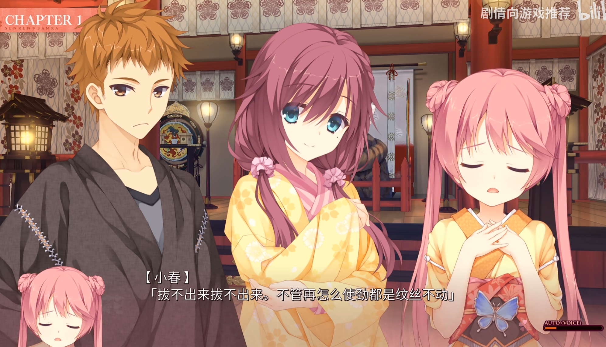
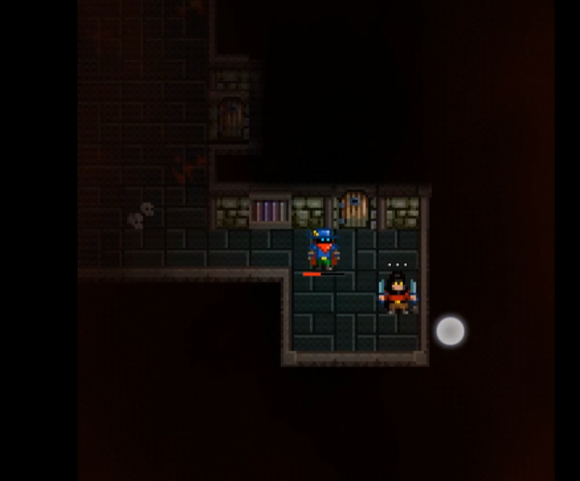

# 美术设计

## 整体美术风格

| 风格                 | 参考                                                         |
| -------------------- | ------------------------------------------------------------ |
| 人物立绘风格         | gal的略微厚涂感觉  |
| 地图风格             | 像素  |
| 地图上怪物和人物风格 | 像素  |

## 美术设计

参考[角色设计](##角色设计)

## 美术需求

| 需求                                 | 说明           | 参考                                                         |
| ------------------------------------ | -------------- | ------------------------------------------------------------ |
| 主角的全身立绘*5（宽高比：600\*720） | 生气           |                                                              |
|                                      | 高兴           |                                                              |
|                                      | 惊讶           |  |
|                                      | 严肃           |  |
|                                      | 悲伤           |                                                              |
|                                      | 疑惑           |  |
| 女主的全身立绘*5（宽高比：600\*720） | 生气           |                                                              |
|                                      | 高兴           |  |
|                                      | 严肃           |                                                              |
|                                      | 悲伤           |                                                              |
|                                      | 疑惑           |  |
| 主角好基友*5                         |                |  |
|                                      |                |                                                              |
| 图标（520*520）                      | 加速           |                                                              |
| 地图块（520*520）                    | 草地*3         |  |
|                                      | 陆地*3         |                                                              |
|                                      |                |                                                              |
|                                      |                |                                                              |
| 地图上的entity                       | 弓箭手         |                                                              |
|                                      | 魔法师         |                                                              |
|                                      | 剑士           |                                                              |
|                                      | 传送门         |                                                              |
|                                      | 敌人的兵营     |                                                              |
|                                      | 神殿           |                                                              |
| UI                                   | 按钮           |  |
|                                      | 承载按钮的面板 |                                                              |

